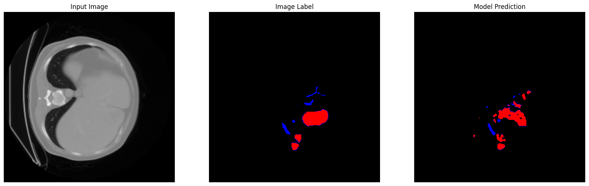
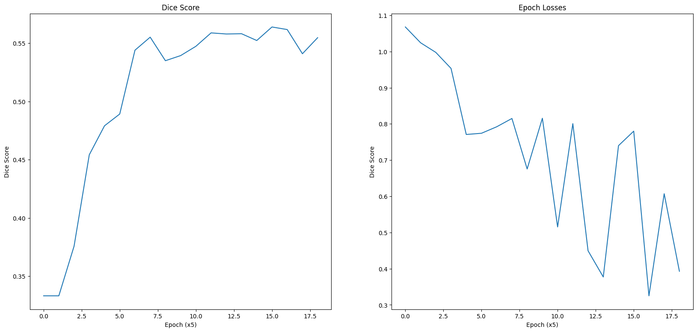

# HepaticVesseSegmentation-UNETR
 An implementation of MONAI's UNETR model on Medical Decathlon's Task 8 - Hepatic Vessel and Tumor Segmentation

## Task:
Hepatic vessel segmentation is quite a tricky task since vessels are structurally microscopic and scarce, particularly in the liver. Their uneven distribution in the liver makes segmentation tasks tedious, since there is now a need for dynamically allocated weights for the vessel and background classes. This procedure however, is crucial for surgical planning and much research is being done on improving and automating the technology being used in the same.

## Data:
This model was trained on data obtained from the Medical Decathlon Challenge and contains CT Scans of patients with a variety of primary and metastatic liver tumors. Additional information about the data can be found at [Arxiv](https://arxiv.org/pdf/1902.09063).

## Training:
The training algorithm was written in ipython and based closely off of MONAI's tutorial on [multi-organ segmentation](https://github.com/Project-MONAI/tutorials/blob/main/3d_segmentation/unetr_btcv_segmentation_3d.ipynb) (BTCV Challenge). Below is an overview of some of the hyper-parameters:  
**Model**: UNETR (MONAI)  
**Loss function**: DiceCELoss (MONAI)  
**Evaluation Metric**: DiceMetric  
**Epoch count**: 100  
**Transforms** (MONAI):
 - [SpatialPad](https://docs.monai.io/en/stable/transforms.html#monai.transforms.SpatialPad)
 - [Resize](https://docs.monai.io/en/stable/transforms.html#resize)
 - [RandomRotate](https://docs.monai.io/en/stable/transforms.html#monai.transforms.RandRotate90)
 - [RandomFlip](https://docs.monai.io/en/stable/transforms.html#randflip)
 - [RandomIntensityShift](https://docs.monai.io/en/stable/transforms.html#monai.transforms.RandShiftIntensity)

## Results
The current model was trained on image resolution of 224 * 224 * 224 and shows a Dice score of 56.39%. Despite a disappointingly low dice score, the generated prediction maps seem fairly accurate, potentially meaning that the evaluation metric assigned wrong weights to compute the scores. Given below is an example of the model prediction   

Shown below is the learning pattern across 100 epochs, monitored once every 5 epochs:


## Usage
> [!NOTE]  
> best_metric_model.pth was `split` into uploadable chunks for GitHub and requires reconstruction prior to viewing results

Reconstruct [model pickle](/best_metric_model/) using the following command (in project root) on linux and macOS (Windows users can run [this](/best_metric_model/merge.ps1) to achieve the same effect)  
```bash
cat ./best_metric_model/bmm_a* > best_metric_model.pth
```
Modify and run [this](/HepaticVesselSegmentation3.ipynb) to begin training  
View [this](/savefile.json) to see raw results  
Run [this](/Results.ipynb) for viewing plotted results and model prediction examples  